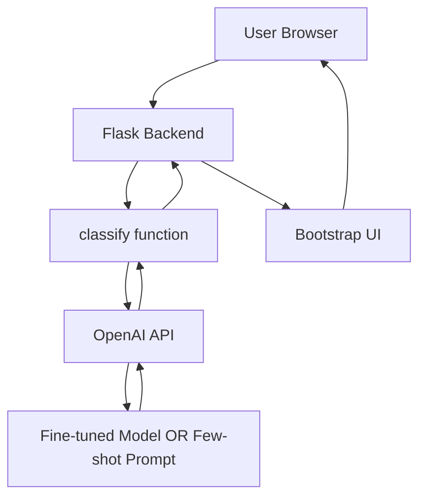

# 🚀 NLP Sentiment App

[](https://www.python.org/downloads/)
[](https://flask.palletsprojects.com/)
[](https://openai.com/api/)
[](LICENSE)

> A complete end-to-end sentiment analysis pipeline that transforms raw review data into a production-ready web service using OpenAI's models.

## ✨ Features

- 📊 **Complete Data Pipeline** - From raw HTML reviews to clean datasets
- 🤖 **Dual Model Support** - Fine-tuned models OR few-shot prompting
- 🎨 **Modern Web UI** - Bootstrap-powered real-time classification interface
- 🔄 **Flexible Architecture** - Easy to swap between model approaches
- 📈 **Production Ready** - Built with Flask for easy deployment

## 🏗️ Architecture



### 📋 Data Pipeline

```
Raw Reviews (.review files)
           ↓
    build_csv_from_reviews.py
           ↓
      reviews.csv
           ↓
    prepare_for_finetune.py
           ↓
   JSONL Training Files
           ↓
      fine_tune.py
           ↓
    Fine-tuned Model
```

## 📁 Project Structure

```
nlp-sentiment-app/
├── 🐍 app.py                    # Main Flask application
├── 🧠 openai_trained.py         # Classification logic
├── 🔧 dataPreparing.py          # Data cleaning utilities
├── 📂 scripts/
│   ├── build_csv_from_reviews.py
│   └── prepare_for_finetune.py
├── 📂 data/
│   ├── books/
│   ├── electronics/
│   ├── dvd/
│   └── kitchen_&_housewares/
├── 📂 artifacts/
│   ├── train.jsonl
│   ├── val.jsonl
│   └── test.jsonl
├── 📊 reviews.csv
├── 📋 requirements.txt
└── 📖 README.md
```

## 🚀 Quick Start

### Prerequisites

-  Python 3.10+
-  OpenAI API key

### 1️⃣ Clone & Setup

```bash
git clone https://github.com/yourusername/nlp-sentiment-app.git
cd nlp-sentiment-app

# Create virtual environment
python -m venv .venv
source .venv/bin/activate  # On Windows: .venv\Scripts\activate

# Install dependencies
pip install -r requirements.txt
```

### 2️⃣ Configure API Key

```bash
export OPENAI_API_KEY="your-api-key-here"
# Windows PowerShell: $env:OPENAI_API_KEY="your-api-key-here"
```

> ⚠️ **Security Note**: Never commit your API key to version control!

### 3️⃣ Prepare Your Data

```bash
# Build dataset from raw reviews (optional)
python scripts/build_csv_from_reviews.py

# Prepare training files
python scripts/prepare_for_finetune.py
```

### 4️⃣ Choose Your Model Path

#### Option A: Fine-tuned Model (Recommended) 🎯

```bash
python scripts/fine_tune.py
# Note the model ID: ft:gpt-4o-mini-2024-07-18:...
export FINETUNED_MODEL="ft:gpt-4o-mini-2024-07-18:your-model-id"
```

#### Option B: Few-shot Prompting (Quick Start) ⚡

Skip the fine-tuning step - the app will use few-shot examples automatically!

### 5️⃣ Launch the App

```bash
python app.py
```

🎉 Open [http://127.0.0.1:5000](http://127.0.0.1:5000) in your browser!

## 🔧 How It Works

### 🧹 Data Processing Pipeline

1. **Raw Data Ingestion**
   - Parses HTML-like `.review` files using BeautifulSoup
   - Extracts clean text content
   - Labels based on filename (`positive.review` → positive)

2. **Text Cleaning**
   - Lowercase conversion
   - Punctuation removal (keeps apostrophes in contractions)
   - Stopword filtering
   - Optional spell correction
   - Deduplication

3. **Training Data Generation**
   ```json
   {
     "messages": [
       {"role": "user", "content": "loved fast delivery amazing quality"},
       {"role": "assistant", "content": "positive"}
     ]
   }
   ```

### 🤖 Model Options

| Feature | Fine-tuned Model | Few-shot Prompting |
|---------|-----------------|-------------------|
| Setup Time | Longer (training required) | Immediate |
| Accuracy | Higher | Good |
| Cost | Lower per request | Higher per request |
| Customization | Full control | Limited |
| Best For | Production, scale | Prototyping, testing |

## 🌐 API Reference

### `POST /classify`

**Request:**
```json
{
  "text": "This product exceeded my expectations!"
}
```

**Response:**
```json
{
  "sentiment": "positive",
  "confidence": 0.95
}
```

### Example Usage

```javascript
fetch('/classify', {
  method: 'POST',
  headers: {'Content-Type': 'application/json'},
  body: JSON.stringify({text: 'Great product, highly recommend!'})
})
.then(response => response.json())
.then(data => console.log(data));
```

## 🎨 UI Features

- **Real-time Classification** - Instant sentiment analysis as you type
- **Visual Feedback** - Color-coded results (🟢 positive, 🔴 negative)
- **Confidence Scores** - See how certain the model is
- **Responsive Design** - Works on desktop and mobile
- **Clean Interface** - Bootstrap-powered modern UI

## 🛠️ Troubleshooting

<details>
<summary><strong>🔴 Fine-tuning Upload Error</strong></summary>

**Problem:** `400: File type not supported`

**Solution:** Make sure you're uploading JSONL files with `purpose="fine-tune"`, not CSV files.
</details>

<details>
<summary><strong>🔴 SDK Error</strong></summary>

**Problem:** `TypeError: create() got an unexpected keyword argument 'response_format'`

**Solution:** Update your OpenAI SDK:
```bash
pip install -U openai
```
</details>


## 🤝 Contributing

Welcome contributions! Here's how to get started:

1. Fork the repository
2. Create a feature branch (`git checkout -b feature/amazing-feature`)
3. Commit your changes (`git commit -m 'Add amazing feature'`)
4. Push to the branch (`git push origin feature/amazing-feature`)
5. Open a Pull Request

## 📄 License

This project is licensed under the MIT License - see the [LICENSE](LICENSE) file for details.


<div align="center">

**⭐ Star this repo if you find it helpful!**

Made with 🧠 and ☕ by [Cesar Ocampo](https://github.com/ipso-ferro)

</div>
